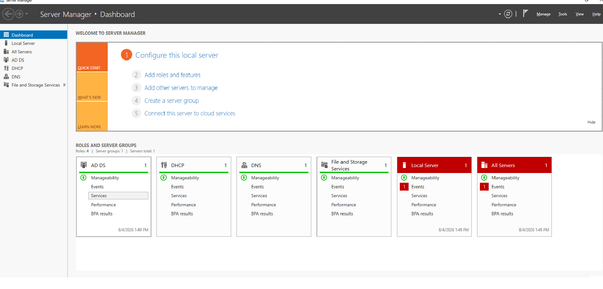
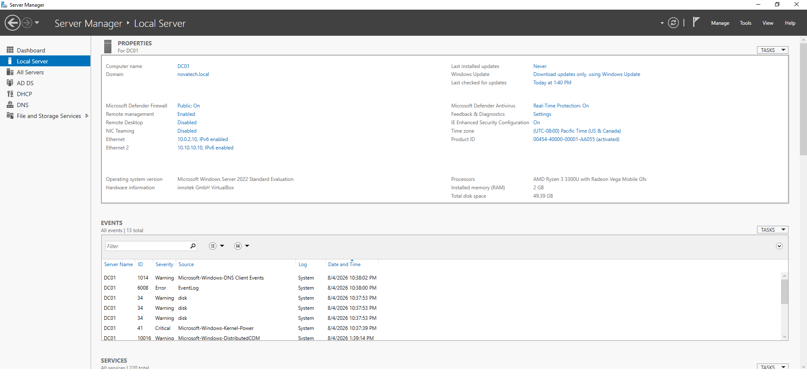
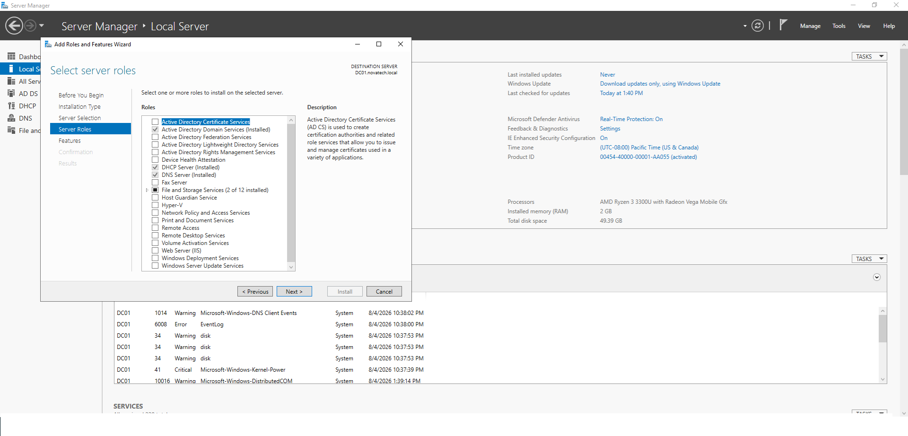

# 🖥️ Windows Server 2022 Installation & Initial Configuration

> This document describes the deployment and initial configuration of the Windows Server 2022 system used as the primary Domain Controller (DC01) for the NOVATECH Enterprise Infrastructure project.

---

# 🎯 Objective

The objective of this phase was to prepare a stable Windows Server environment that would serve as the foundation for the enterprise infrastructure.

This included:

- Installing Windows Server 2022
- Configuring the server with a static IP address
- Renaming the server to **DC01**
- Preparing the server for Active Directory Domain Services (AD DS)
- Verifying the operating system before deploying additional services

---

# 🏗️ Design Overview

The Windows Server installation serves as the foundation of the NOVATECH infrastructure.

This server was configured to operate as the first Domain Controller in the environment and hosts several core enterprise services, including:

- Active Directory Domain Services (AD DS)
- DNS
- DHCP
- File Services

A static IP address was assigned to ensure reliable communication with domain clients and infrastructure services.

---

# 🛠️ Implementation

The following tasks were completed:

- Installed Windows Server 2022 Standard Evaluation
- Configured a static IPv4 address
- Renamed the server to **DC01**
- Verified network connectivity
- Confirmed successful operating system installation
- Prepared the server for enterprise role deployment

---

# ⚙️ Configuration

| Setting | Value |
|---------|-------|
| Server Name | DC01 |
| Operating System | Windows Server 2022 Standard Evaluation |
| Domain | novatech.local |
| Virtualization Platform | Oracle VirtualBox |
| Network Configuration | Static IPv4 |

---

# 📸 Screenshots

## Server Manager Dashboard

**Description**

Displays the Windows Server dashboard after the initial installation and confirms that the server is operational.

---

## Local Server Configuration

**Description**

Shows the local server properties, including hostname, domain membership, and network configuration.

---

## Installed Roles

**Description**

Demonstrates that the required Windows Server roles, including Active Directory Domain Services, DNS Server, and DHCP Server, have been installed.

---

## Server Configuration

**Description**

Shows the final server configuration, including the computer name, domain membership, operating system version, and network settings.

---

# 🧩 Challenges & Solutions

### Challenge

Ensuring the server was fully prepared before deploying enterprise services.

### Solution

Verified the server configuration, confirmed static IP addressing, validated installed roles, and ensured the operating system was functioning correctly before continuing with Active Directory deployment.

---

# ✅ Outcome

The Windows Server installation was successfully completed and prepared for enterprise infrastructure deployment.

The server was configured as **DC01**, assigned a static IP address, and successfully prepared to host Active Directory Domain Services, DNS, DHCP, and additional enterprise services.

---

# 💡 Key Takeaways

- Windows Server provides the foundation for enterprise identity infrastructure.
- Proper initial configuration simplifies future deployment tasks.
- Static IP addressing is essential for infrastructure servers.
- Verifying server configuration before role deployment helps prevent future configuration issues.