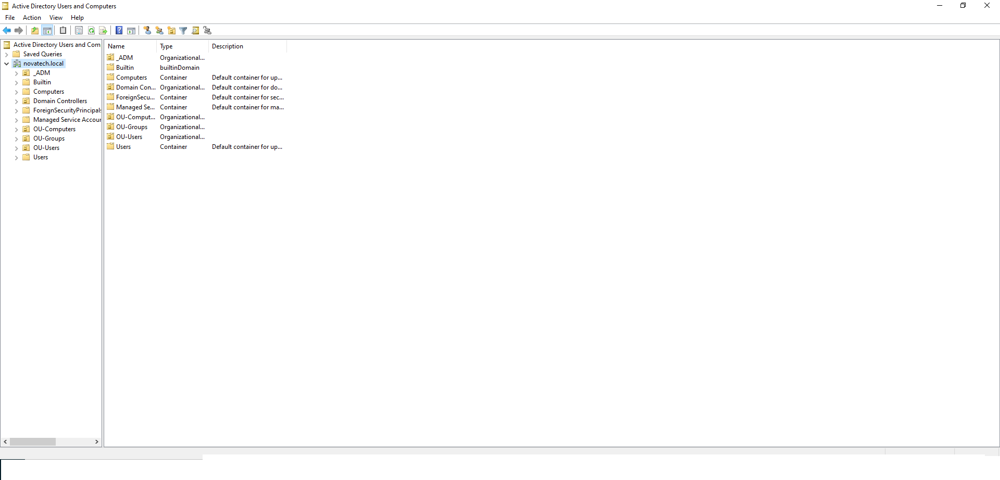
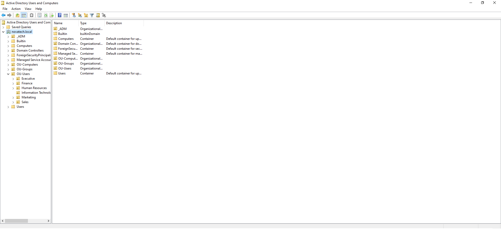
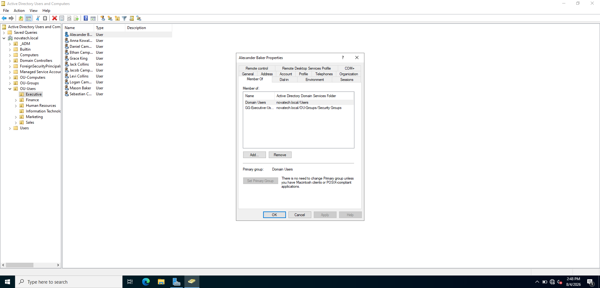
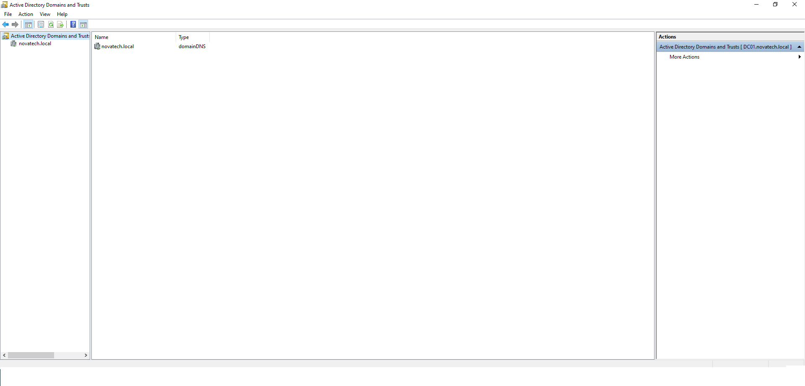

# 👥 Active Directory Domain Services (AD DS)

> This document describes the deployment and configuration of Active Directory Domain Services (AD DS) for the NOVATECH Enterprise Infrastructure project.

---

# 🎯 Objective

The objective of this phase was to deploy Active Directory Domain Services and establish a centralized identity management system for the NOVATECH enterprise environment.

This implementation provides:

- Centralized user authentication
- Organizational Unit (OU) management
- Security group administration
- Domain-based resource management
- A foundation for Group Policy and enterprise identity services

---

# 🏗️ Design Overview

A new Active Directory forest and domain named **novatech.local** was deployed.

The server **DC01** was promoted to the first Domain Controller and became responsible for:

- User authentication
- Directory services
- Security group management
- Organizational Unit administration
- Domain management

The Active Directory structure was designed using Organizational Units to logically separate users, computers, and security groups.

---

# 🛠️ Implementation

The following tasks were completed:

- Installed the Active Directory Domain Services role
- Promoted DC01 to a Domain Controller
- Created the **novatech.local** forest
- Designed a logical Organizational Unit structure
- Created departmental Organizational Units
- Created security groups
- Imported over 100 users using PowerShell automation
- Assigned users to departmental security groups

---

# ⚙️ Configuration

| Setting | Value |
|---------|-------|
| Domain Name | novatech.local |
| Domain Controller | DC01 |
| Forest Functional Level | Windows Server 2022 |
| Domain Functional Level | Windows Server 2022 |
| User Deployment | PowerShell Automation |

---

# 📸 Screenshots

## Active Directory Users and Computers

**Description**

Shows the Active Directory Users and Computers console with the **novatech.local** domain and custom Organizational Units.

---

## Organizational Unit Structure

**Description**

Displays the Organizational Unit hierarchy used to organize departments and simplify administration.

---

## Imported Users

**Description**

Shows user accounts created automatically through the PowerShell provisioning script.

---

## User Properties

**Description**

Demonstrates successful user creation and group membership assignment within Active Directory.

---

## Active Directory Domains and Trusts

**Description**

Shows the **novatech.local** Active Directory domain.

---

## Active Directory Sites and Services

**Description**

Displays the Active Directory site configuration and the placement of the Domain Controller within the default site.

---

# 🧩 Challenges & Solutions

### Challenge

Managing a large number of users manually would have been time-consuming and prone to errors.

### Solution

PowerShell automation was used to provision more than 100 user accounts, assign them to Organizational Units, and configure security group memberships consistently.

---

# ✅ Outcome

Active Directory Domain Services was successfully deployed, providing centralized identity management for the NOVATECH enterprise environment.

The environment now includes:

- A functioning Active Directory domain
- Organizational Unit hierarchy
- Security groups
- Automated user provisioning
- Centralized user management

---

# 💡 Key Takeaways

- Active Directory provides centralized identity and access management.
- Organizational Units simplify administrative delegation and policy application.
- Security groups enable scalable permission management.
- PowerShell automation dramatically reduces the time required to provision users while improving consistency and reducing human error.