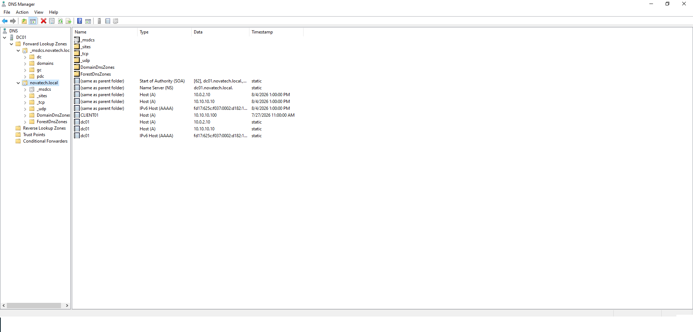
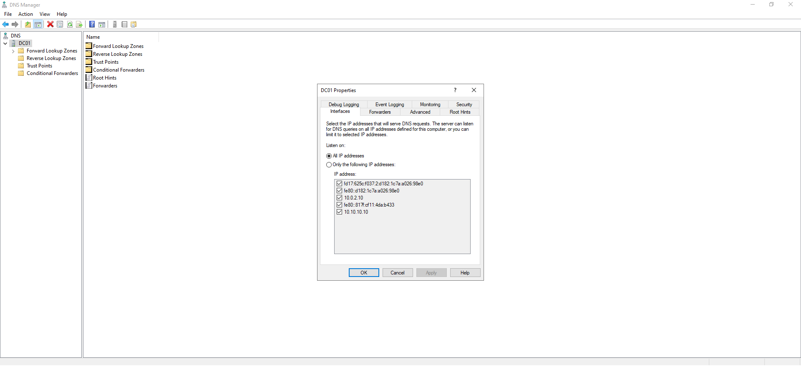

# 🌐 DNS Configuration

> This document describes the deployment and configuration of the Domain Name System (DNS) service for the NOVATECH Enterprise Infrastructure project.

---

# 🎯 Objective

Deploy and configure Domain Name System (DNS) services to support Active Directory Domain Services (AD DS). DNS provides reliable name resolution for domain resources and enables authentication, service discovery, and communication throughout the enterprise environment.

---

# 🏗️ Design Overview

The DNS Server role was installed on the primary Domain Controller (**DC01**) and configured as an Active Directory–integrated DNS server.

The deployment includes:

- 🌐 Active Directory–integrated Forward Lookup Zone
- 🖥️ Host (A) records
- 📍 Name Server (NS) records
- 📄 Start of Authority (SOA) records
- 🔄 Automatic DNS registration

This configuration enables domain clients to locate Active Directory services and resolve hostnames across the network.

---

# 🛠️ Implementation

The following tasks were completed:

- Installed the DNS Server role
- Configured an Active Directory–integrated Forward Lookup Zone
- Verified DNS service functionality
- Confirmed automatic DNS record registration
- Validated hostname resolution within the domain

---

# ⚙️ Configuration

| Setting | Value |
|---------|-------|
| DNS Server | DC01 |
| Zone Type | Active Directory Integrated |
| Forward Lookup Zone | novatech.local |
| Dynamic Updates | Secure |
| Host Records | Automatic Registration |

> **Note:** A Reverse Lookup Zone was not configured during this project because the focus was on implementing the DNS services required to support Active Directory.

---

# 📸 Screenshots

## DNS Manager Overview

**Description**

Displays the DNS Manager console showing the DNS server and the available DNS zones.

---

## Forward Lookup Zone

**Description**

Shows the **novatech.local** Active Directory–integrated Forward Lookup Zone, including the automatically created SOA, NS, and Host (A) records.

---

## DNS Server Properties

**Description**

Displays the DNS server configuration, including the network interfaces used to respond to DNS requests.

---

# 🧩 Challenges & Solutions

### Challenge

Ensuring that Active Directory services could successfully locate domain resources through DNS.

### Solution

Configured an Active Directory–integrated DNS zone and verified that the required DNS records were automatically created and functioning correctly.

---

# ✅ Outcome

The DNS infrastructure was successfully deployed and integrated with Active Directory. Domain resources were able to register automatically, providing reliable name resolution required for authentication and communication across the enterprise environment.

---

# 💡 Key Takeaways

- DNS is the foundation of Active Directory.
- Active Directory depends on DNS for authentication and service discovery.
- Active Directory–integrated DNS zones simplify administration and improve reliability.
- Automatic DNS registration reduces manual configuration and administrative effort.
- Proper DNS configuration is critical for a stable enterprise infrastructure.