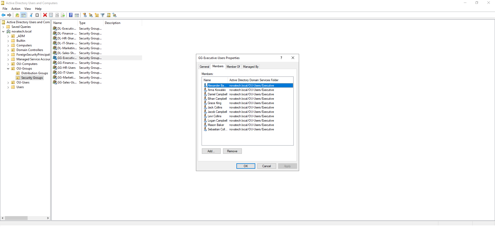

# 🔐 Active Directory Security Groups

> This document describes the creation and management of Active Directory Security Groups within the NOVATECH Enterprise Infrastructure project.

---

# 🎯 Objective

Implement departmental security groups to simplify user administration and prepare the environment for scalable access control using Active Directory best practices.

---

# 🏢 Enterprise Scenario

As NOVATECH continued to grow, assigning permissions directly to individual users would become difficult to manage and maintain.

To simplify administration, departmental security groups were created. Users were assigned to groups based on their department, allowing permissions to be managed centrally and preparing the environment for future implementation of the AGDLP access control model.

---

# 🏗️ Design Overview

Security Groups were created for each business department and stored within a dedicated Organizational Unit.

The implementation includes:

- 🔐 Departmental Global Security Groups
- 👥 User-to-Group Membership
- 🏢 Logical Group Organization
- 📈 Scalable Permission Management

This approach reduces administrative overhead and supports future expansion.

---

# 🛠️ Implementation

The following tasks were completed:

- Created departmental Global Security Groups
- Organized groups within the OU-Groups Organizational Unit
- Assigned users to their respective departmental groups
- Verified successful group membership assignments

---

# ⚙️ Configuration

| Configuration | Value |
|--------------|-------|
| Group Type | Security |
| Group Scope | Global |
| Storage Location | OU-Groups |
| Membership | Departmental Users |

---

# 📸 Screenshots

## Security Groups Overview

**Description**

Displays the Organizational Unit containing the departmental security groups.

---

## Group Properties

**Description**

Shows the configuration of a departmental security group, including its scope and type.

---

## Group Members

**Description**

Demonstrates successful assignment of users to a departmental security group.

---

# 🧩 Challenges & Solutions

### Challenge

Managing permissions for individual users becomes increasingly difficult as the organization grows.

### Solution

Implemented Global Security Groups for each department, allowing permissions to be assigned to groups instead of individual user accounts.

---

# ✅ Outcome

Departmental Security Groups were successfully implemented and populated with users. This provides a scalable foundation for future file share permissions, delegated administration, and Group Policy management.

---

# 💡 Key Takeaways

- 🔐 Security Groups simplify permission management.
- 👥 Assigning users to groups is more scalable than assigning permissions directly to individual accounts.
- 🏢 Department-based grouping improves administrative organization.
- 📈 Proper group design supports enterprise growth.
- 🚀 Security Groups form a key component of the AGDLP access control model.