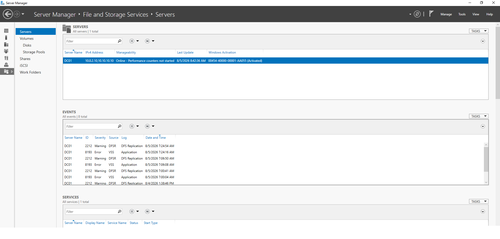
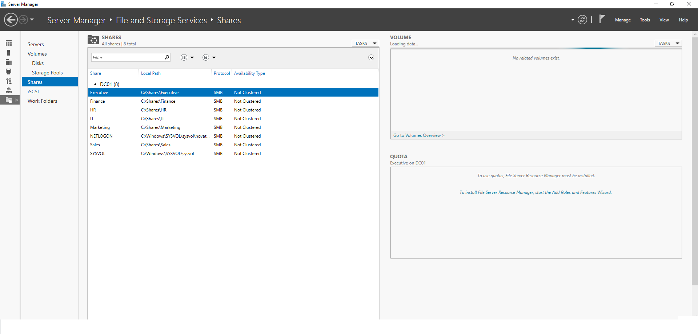
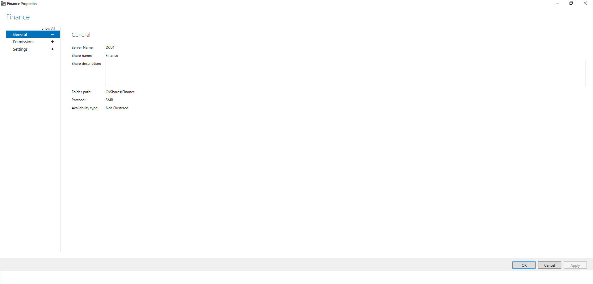
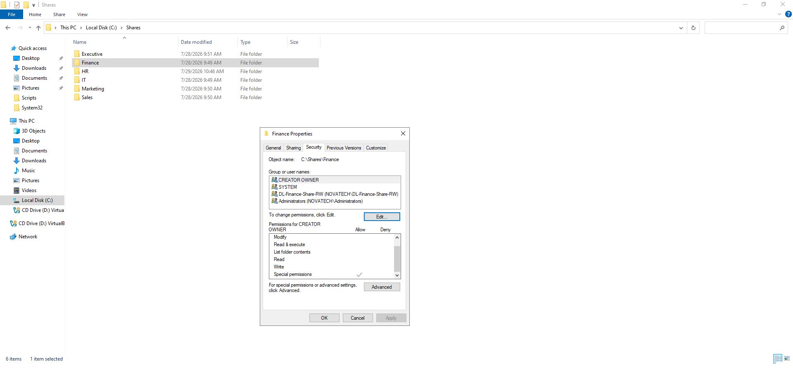

# 📁 File Services

## Overview

Enterprise environments rely on centralized file servers to securely store and share departmental data.

This implementation provides SMB shared folders for each department while using Active Directory security groups to manage access permissions according to Microsoft best practices.

---

# Objectives

- Deploy centralized SMB file shares
- Organize departmental storage
- Configure NTFS permissions
- Implement group-based access control
- Prepare infrastructure for enterprise collaboration

---

# Technologies Used

- Windows Server 2022
- Server Manager
- SMB File Sharing
- NTFS Permissions
- Active Directory
- AGDLP Access Control Model

---

# Implementation

Departmental folders were created under:

```text
C:\Shares
```

Each folder was published as an SMB share.

Examples include:

- Executive
- Finance
- HR
- IT
- Marketing
- Sales

Rather than assigning permissions directly to users, access was delegated through Active Directory security groups.

This approach improves scalability, security, and administrative efficiency.

---

# Screenshots

## 1. File Server Overview



Shows the File and Storage Services console used to manage SMB shares.

---

## 2. Shared Folders



Displays all departmental SMB shares configured on the server.

---

## 3. Share Properties



Shows the Finance SMB share configuration including the local folder path and share information.

---

## 4. NTFS Permissions



Illustrates NTFS permissions configured through Domain Local Security Groups, following the AGDLP access control model.

---

# Security Design

The shared folders use two layers of protection:

- SMB Share Permissions
- NTFS Permissions

User access is controlled through Active Directory security groups rather than direct user assignments.

This follows Microsoft's recommended enterprise security practices.

---

# Outcome

Successfully implemented:

- Centralized departmental file shares
- SMB network sharing
- NTFS permission management
- Group-based authorization
- Enterprise file server organization

---

# Key Takeaways

- Centralized file servers simplify administration.
- NTFS permissions provide granular access control.
- SMB enables secure departmental collaboration.
- AGDLP improves permission scalability.
- Security groups reduce administrative overhead.