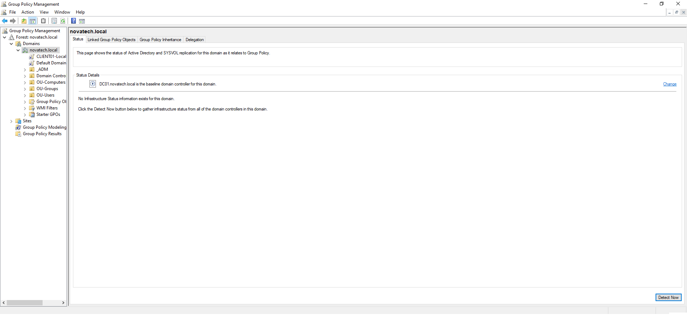
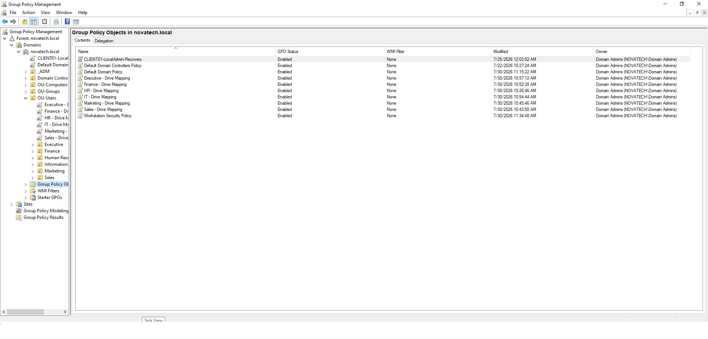
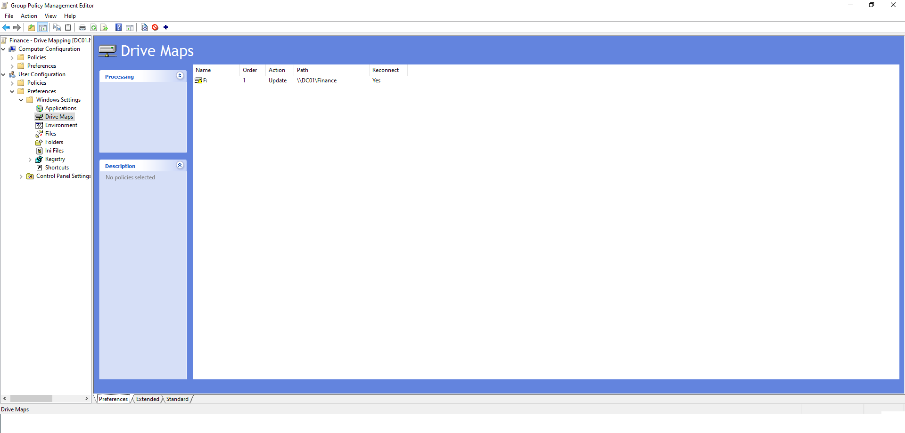

# Group Policy

## Overview

Group Policy was implemented to centrally manage Windows configuration throughout the NOVATECH Active Directory environment.

The environment uses **Group Policy Management (GPMC)** to deploy drive mappings and workstation policies based on Organizational Units (OUs).

---

# Objectives

- Centrally manage Windows settings
- Automate network drive mapping
- Simplify enterprise administration
- Prepare for scalable workstation management

---

# Technologies Used

- Windows Server 2022
- Active Directory
- Group Policy Management Console (GPMC)
- Group Policy Preferences
- SMB File Shares

---

# Implementation

The following Group Policy Objects were configured:

- Finance Drive Mapping
- HR Drive Mapping
- IT Drive Mapping
- Marketing Drive Mapping
- Sales Drive Mapping
- Executive Drive Mapping
- Workstation Security Policy

Each department receives its network drive automatically through Group Policy Preferences.

---

# Screenshot 1 — Group Policy Management

Shows the Group Policy Management Console with the domain structure and Organizational Units used throughout the environment.

---

# Screenshot 2 — Group Policy Objects

Displays the custom Group Policy Objects created for workstation security and department drive mappings.

---

# Screenshot 3 — Finance Drive Mapping

Shows the Finance Drive Mapping Group Policy Preference configured under:

**User Configuration → Preferences → Windows Settings → Drive Maps**

The policy maps the Finance shared folder automatically as the **F:** drive.

---

# Outcome

Successfully implemented:

- Centralized Group Policy management
- Department-specific Drive Mapping
- Automated network drive assignment
- Enterprise-ready GPO structure

---

# Key Takeaways

- Group Policy centralizes Windows administration.
- Group Policy Preferences automate repetitive configuration tasks.
- Drive Mapping improves user experience and reduces administrative overhead.
- Organizational Units provide precise targeting for Group Policy deployment.
- Properly designed GPOs improve scalability and maintainability in enterprise environments.