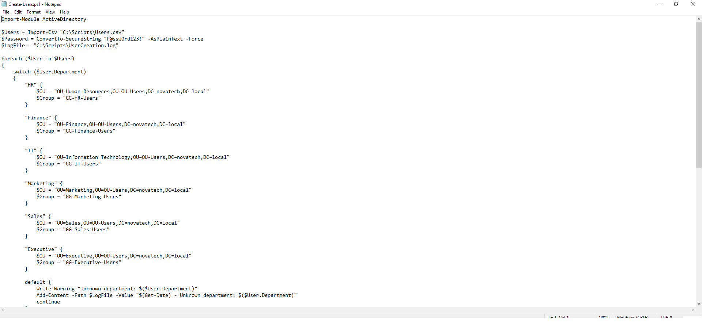
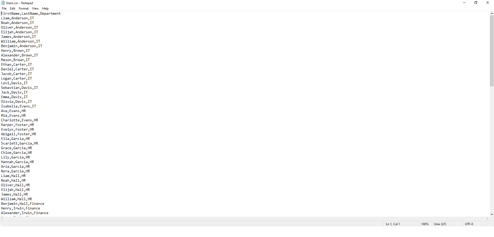

# 💻 PowerShell Automation

## 📌 Overview

Manual user provisioning is time-consuming and prone to human error. To improve consistency and efficiency, PowerShell automation was implemented to create Active Directory user accounts from a CSV file.

The script automatically:

- Imports user information from a CSV file.
- Creates Active Directory user accounts.
- Places users into the correct Organizational Units (OUs).
- Adds users to the appropriate department security groups.
- Records successful and failed operations in a log file.

---

# ⚙️ Technologies Used

- Windows Server 2022
- Active Directory PowerShell Module
- PowerShell
- CSV Data Import
- Active Directory Users and Computers

---

# 📂 Automation Workflow

1. Import employee data from a CSV file.
2. Determine the user's department.
3. Select the correct Organizational Unit.
4. Create the Active Directory user account.
5. Add the user to the department Global Security Group.
6. Record the action in a log file.

---

# 📸 Implementation Screenshots

## 1️⃣ User Provisioning Script

The PowerShell script imports employee information from a CSV file, creates Active Directory users, assigns them to the correct Organizational Unit, and automatically adds them to the appropriate department security group.

---

## 2️⃣ Users CSV File

The CSV file acts as the data source for the automation process and contains user information such as first name, last name, and department.

---

## 3️⃣ Active Directory Results

After execution, the script successfully provisions the user accounts inside their respective Organizational Units within Active Directory.

---

# ✅ Outcome

The automation successfully:

- Created Active Directory user accounts from CSV data.
- Assigned users to department-specific Organizational Units.
- Added users to the correct Global Security Groups.
- Eliminated repetitive manual account creation.
- Logged successful and failed operations for auditing and troubleshooting.

---

# 💡 Key Takeaways

- ⚡ PowerShell significantly reduces repetitive administrative tasks.
- 📂 CSV-driven automation allows rapid bulk user provisioning.
- 👥 Automated group membership ensures consistent access control.
- 📝 Logging improves auditing and troubleshooting.
- 🛠️ Infrastructure automation increases scalability and operational efficiency.